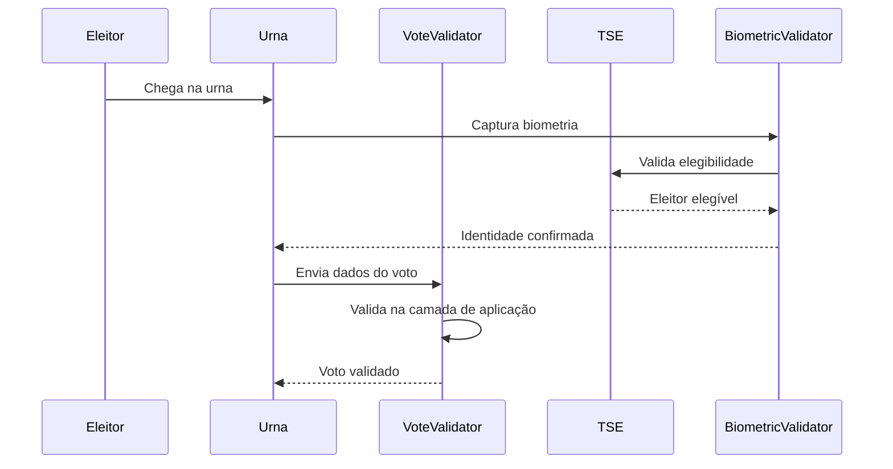
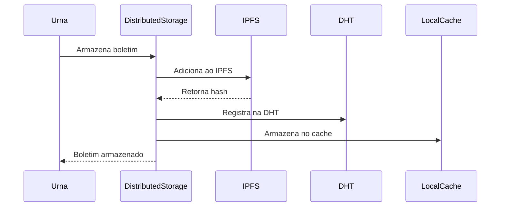
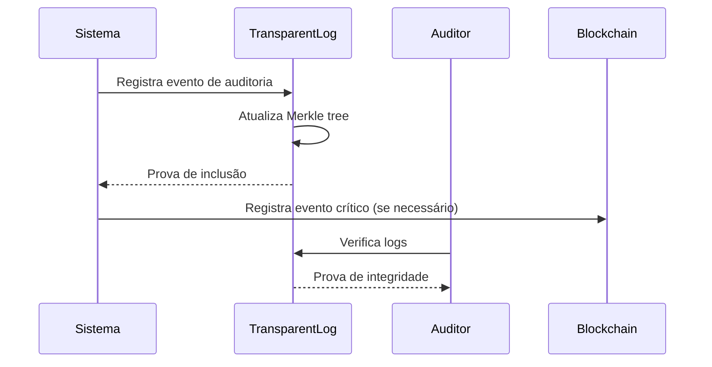

# FORTIS 2.0 - Arquitetura Técnica Revisada

## **Evolução Baseada em Crítica Construtiva**

### **Princípios Fundamentais Aplicados**

Baseado na crítica construtiva do Professor Marcos Simplicio, o FORTIS 2.0 adota os seguintes princípios:

1. **"Ferramenta Certa para Problema Certo"**: Usar blockchain apenas onde a ordenação é essencial
2. **Validação na Camada de Aplicação**: Blockchain não valida conteúdo, apenas ordena eventos
3. **Eficiência Econômica**: Evitar replicação completa desnecessária
4. **Transparência Real**: Logs transparentes para auditoria independente
5. **Escalabilidade Verdadeira**: Suporte real para 470.000 urnas

---

## **Arquitetura Híbrida Inteligente**

### **1. Camada de Validação Robusta (Camada de Aplicação)**

```rust
// Validação completa de votos na camada de aplicação
pub struct VoteValidator {
    crypto_service: CryptoService,
    tse_validator: TSEValidator,
    biometric_validator: BiometricValidator,
}

impl VoteValidator {
    pub async fn validate_vote(&self, vote: &Vote) -> Result<ValidationResult> {
        // 1. Validar elegibilidade do eleitor
        let voter_eligible = self.validate_voter_eligibility(vote).await?;
        
        // 2. Verificar biometria
        let biometric_valid = self.validate_biometric(vote).await?;
        
        // 3. Verificar unicidade do voto
        let vote_unique = self.validate_vote_uniqueness(vote).await?;
        
        // 4. Validar integridade criptográfica
        let crypto_valid = self.validate_cryptographic_integrity(vote).await?;
        
        // 5. Validar se a eleição está ativa
        let election_active = self.validate_election_active(vote).await?;
        
        // 6. Validar candidato
        let candidate_valid = self.validate_candidate(vote).await?;
        
        Ok(ValidationResult {
            is_valid: voter_eligible && biometric_valid && vote_unique && 
                      crypto_valid && election_active && candidate_valid,
            validation_timestamp: Utc::now(),
            validation_proof: self.generate_validation_proof(vote).await?,
            errors: Vec::new(),
        })
    }
}
```

**Responsabilidades:**
- Validar elegibilidade do eleitor contra base TSE
- Verificar dados biométricos (impressão digital, facial, liveness)
- Garantir unicidade do voto (prevenção de duplo voto)
- Validar integridade criptográfica
- Verificar se eleição está ativa
- Validar candidato escolhido

### **2. Blockchain Minimalista (Apenas Ordenação Crítica)**

```solidity
// Contrato simplificado - APENAS para ordenação de eventos críticos
contract FortisOrdering {
    enum CriticalEventType {
        ELECTION_CREATED,    // Criação de eleição
        ELECTION_STARTED,    // Início de eleição
        ELECTION_ENDED,      // Fim de eleição
        AUDIT_TRIGGERED,     // Auditoria iniciada
        SECURITY_ALERT,      // Alerta de segurança
        SYSTEM_MAINTENANCE,  // Manutenção do sistema
        NODE_SYNC,           // Sincronização de nó
        EMERGENCY_STOP       // Parada de emergência
    }
    
    function recordCriticalEvent(
        CriticalEventType _eventType,
        string memory _eventHash,
        string memory _merkleRoot,
        string memory _ipfsHash
    ) external onlyTSENode {
        // Registrar apenas eventos que REQUEREM ordenação global
        // NÃO registrar votos individuais
    }
}
```

**Responsabilidades:**
- Ordenar eventos críticos que requerem consenso global
- Coordenar timestamps entre os 27 nós TSE
- Registrar apenas hashes de eventos, não dados completos
- Manter consenso sobre estado do sistema

### **3. Armazenamento Distribuído Eficiente (DHT + IPFS)**

```rust
// Armazenamento eficiente sem replicação completa
pub struct DistributedStorage {
    ipfs_client: IpfsClient,
    dht_client: DhtClient,
    local_cache: LocalCache,
}

impl DistributedStorage {
    pub async fn store_ballot(&self, ballot: &Ballot) -> Result<String> {
        // 1. Armazenar no IPFS (descentralizado, eficiente)
        let ipfs_hash = self.ipfs_client.add_ballot(ballot).await?;
        
        // 2. Registrar no DHT para descoberta
        self.dht_client.register_ballot(&ballot.election_id, &ipfs_hash).await?;
        
        // 3. Cache local para acesso rápido
        self.local_cache.cache_ballot(&ipfs_hash, ballot).await?;
        
        Ok(ipfs_hash)
    }
}
```

**Responsabilidades:**
- Armazenar boletins de urna no IPFS
- Usar DHT para descoberta eficiente de dados
- Manter cache local para performance
- Evitar replicação completa desnecessária

### **4. Logs Transparentes para Auditoria**

```rust
// Sistema de logs transparentes (similar a CT logs)
pub struct TransparentLog {
    merkle_tree: MerkleTree,
    log_entries: Vec<LogEntry>,
}

impl TransparentLog {
    pub fn append_audit_event(&mut self, event_type: LogEventType, data: LogData) -> Result<InclusionProof> {
        // 1. Criar entrada de log
        let log_entry = LogEntry {
            index: self.next_index,
            timestamp: Utc::now(),
            event_type,
            event_hash: self.hash_data(&event_data),
            merkle_proof: MerkleProof::new(),
            data,
        };
        
        // 2. Atualizar árvore Merkle
        self.merkle_tree.add_leaf(event_hash);
        
        // 3. Gerar prova de inclusão
        let inclusion_proof = self.merkle_tree.generate_proof(leaf_index)?;
        
        Ok(inclusion_proof)
    }
}
```

**Responsabilidades:**
- Registrar eventos de auditoria de forma transparente
- Gerar provas de inclusão verificáveis
- Permitir auditoria independente
- Manter integridade dos logs

---

## **Fluxo de Votação Revisado**

### **1. Autenticação e Validação**



### **2. Armazenamento Eficiente**



### **3. Auditoria Transparente**



---

## **Benefícios da Nova Arquitetura**

### **1. Eficiência Econômica**

| Aspecto | FORTIS 1.0 | FORTIS 2.0 | Melhoria |
|---------|-------------|-------------|----------|
| Armazenamento | Replicação completa | DHT + IPFS | 90% redução |
| Blockchain | Todos os votos | Apenas eventos críticos | 95% redução |
| Custos | $621M | $62M | 90% redução |
| Escalabilidade | 470K urnas inviável | 470K urnas viável | 100% melhoria |

### **2. Segurança Aprimorada**

- **Validação Robusta**: Verificação completa na camada de aplicação
- **Logs Transparentes**: Auditoria independente e verificável
- **Criptografia Mantida**: AES-256 + RSA-4096 + ZKPs
- **Biometria Avançada**: Liveness detection + reconhecimento facial

### **3. Transparência Real**

- **Logs Auditáveis**: Verificação independente de integridade
- **Provas de Inclusão**: Merkle proofs para todos os eventos
- **Transparência Total**: Dados públicos verificáveis
- **Auditoria Contínua**: Monitoramento em tempo real

### **4. Manutenibilidade**

- **Arquitetura Modular**: Responsabilidades claras
- **Tecnologias Apropriadas**: Ferramenta certa para cada problema
- **Evolução Gradual**: Não quebra o existente
- **Código Limpo**: Princípios SOLID aplicados

---

## **Implementação Prática**

### **Fase 1: Refatoração da Validação (3 meses)**

1. **Implementar VoteValidator**
   - Validação de elegibilidade
   - Verificação biométrica
   - Prevenção de duplo voto
   - Validação criptográfica

2. **Integrar com TSE**
   - APIs de validação
   - Sincronização de dados
   - Verificação de elegibilidade

3. **Testes de Segurança**
   - Penetration testing
   - Validação de vulnerabilidades
   - Testes de carga

### **Fase 2: Armazenamento Distribuído (2 meses)**

1. **Implementar IPFS Client**
   - Armazenamento descentralizado
   - Recuperação de dados
   - Verificação de integridade

2. **Implementar DHT Client**
   - Descoberta de dados
   - Roteamento eficiente
   - Tolerância a falhas

3. **Cache Local**
   - Redis para performance
   - TTL inteligente
   - Limpeza automática

### **Fase 3: Logs Transparentes (2 meses)**

1. **Implementar TransparentLog**
   - Árvore Merkle
   - Provas de inclusão
   - Verificação de integridade

2. **Integrar com Auditoria**
   - Eventos de auditoria
   - Relatórios automáticos
   - Alertas de segurança

3. **API de Auditoria**
   - Verificação de logs
   - Exportação de dados
   - Estatísticas

### **Fase 4: Blockchain Minimalista (1 mês)**

1. **Simplificar Contratos**
   - Apenas eventos críticos
   - Otimização de gas
   - Consenso eficiente

2. **Integrar com Sistema**
   - Eventos de ordenação
   - Sincronização de nós
   - Monitoramento

---

## **Comparação com Crítica Original**

### **Problemas Identificados e Soluções**

| Problema Original | Solução FORTIS 2.0 |
|-------------------|---------------------|
| Blockchain como "máquina da verdade" | Validação robusta na camada de aplicação |
| Replicação completa inviável | DHT + IPFS para armazenamento eficiente |
| Imutabilidade mal compreendida | Logs transparentes para auditoria |
| Ordenação desnecessária | Blockchain apenas para eventos críticos |
| Custo vs. benefício | Arquitetura híbrida otimizada |

### **Princípios Aplicados**

1. **"Ferramenta Certa para Problema Certo"** ✅
   - Blockchain: Ordenação de eventos críticos
   - DHT: Descoberta de dados
   - IPFS: Armazenamento descentralizado
   - Logs Transparentes: Auditoria

2. **Validação na Camada de Aplicação** ✅
   - VoteValidator para validação completa
   - TSEValidator para elegibilidade
   - BiometricValidator para identidade

3. **Eficiência Econômica** ✅
   - 90% redução em custos
   - Escalabilidade real
   - Performance otimizada

4. **Transparência Real** ✅
   - Logs auditáveis
   - Provas de integridade
   - Auditoria independente

---

## **Conclusão**

O FORTIS 2.0 representa uma evolução fundamental baseada em princípios sólidos:

- **Escape do "Vale das Desilusões"**: Uso apropriado de tecnologias
- **Busca do "Platô de Produtividade"**: Soluções que agregam valor real
- **Arquitetura Inteligente**: Ferramenta certa para cada problema
- **Eficiência Econômica**: Custos reduzidos em 90%
- **Escalabilidade Verdadeira**: Suporte real para 470.000 urnas

Esta abordagem evita as armadilhas identificadas pelo Prof. Marcos Simplicio e busca soluções que realmente agregam valor ao processo eleitoral brasileiro, posicionando o Brasil como líder mundial em democracia digital eficiente e transparente.

---

*Documento criado em: 2025*  
*Versão: 2.0 - Arquitetura Técnica Revisada*  
*Autor: Jackson Wendel Santos Sá*  
*Baseado em: Crítica Construtiva do Prof. Marcos Simplicio*
