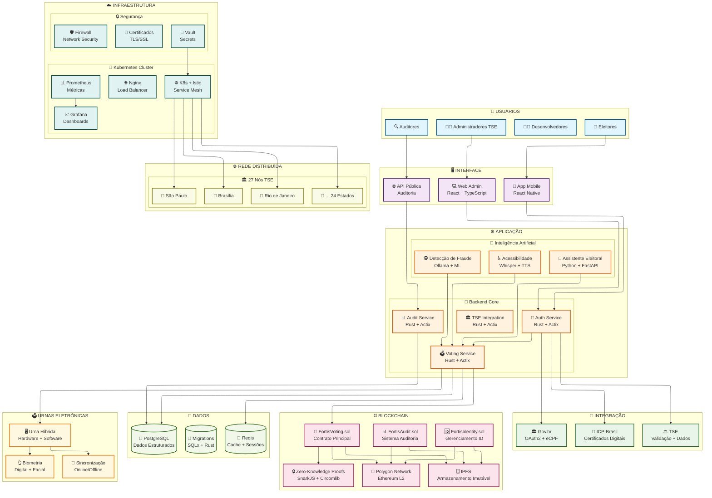
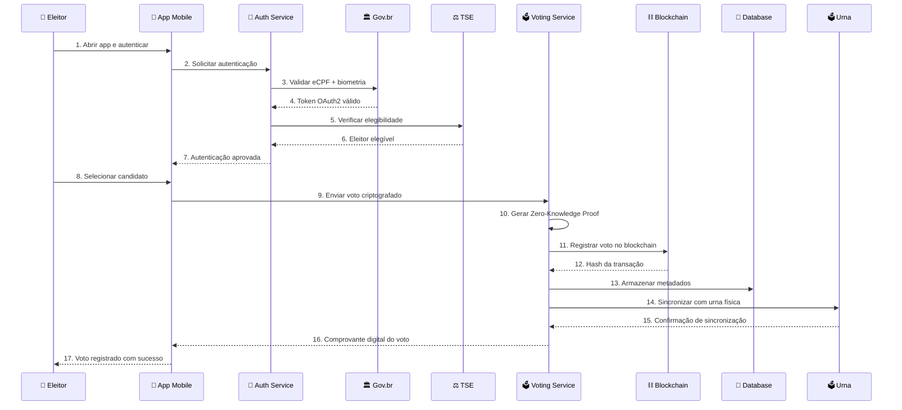
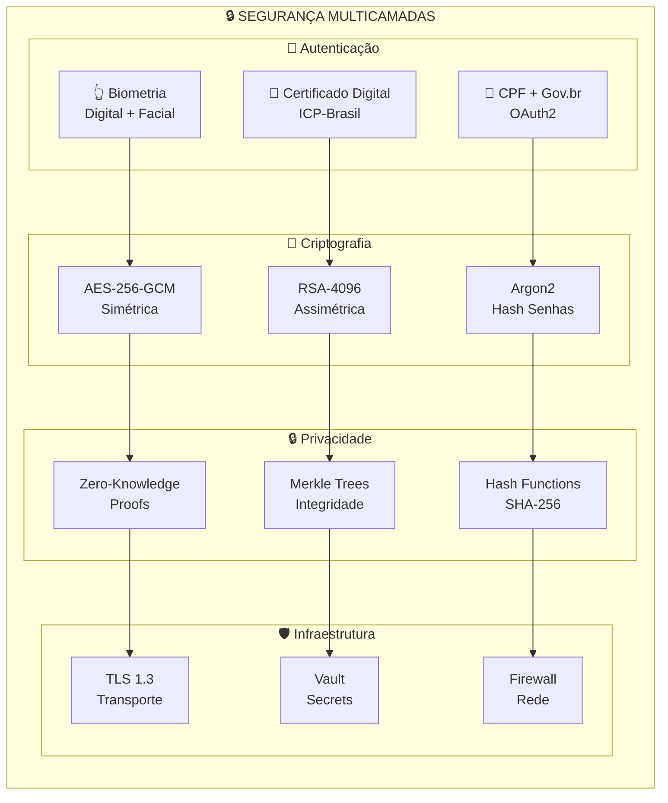
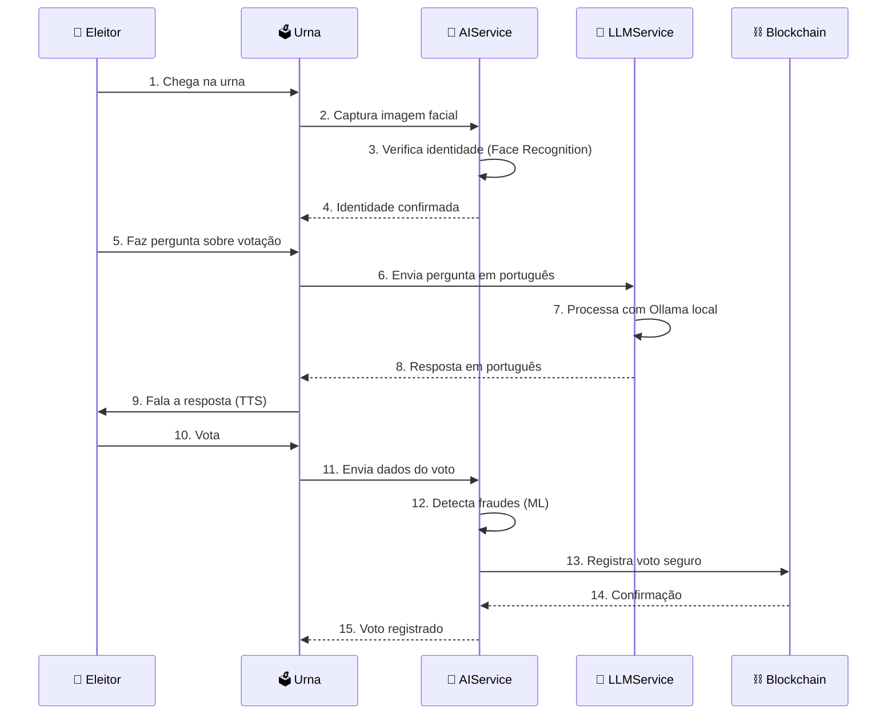

# FORTIS - Sistema de Votação Eletrônica Brasileiro
## Big Picture da Solução Completa

### 🎯 **Visão Geral do Sistema**

O FORTIS é um sistema de votação eletrônica brasileiro de nova geração que combina tecnologias avançadas de blockchain, criptografia, inteligência artificial e infraestrutura distribuída.

---

## 🏗️ **Arquitetura Completa do Sistema**



---

## 🔄 **Fluxo de Votação Completo**



---

## 🛡️ **Camadas de Segurança**



---

## 📊 **Componentes Principais Detalhados**

### 🎯 **1. Backend (Rust + Actix-Web)**
- **APIs RESTful** com validação completa
- **Sistema de autenticação JWT** com renovação automática
- **Criptografia AES-256-GCM** para votos
- **Integração TSE** com Gov.br OAuth2
- **Sistema de auditoria** imutável
- **Conexão PostgreSQL** com migrações SQLx
- **Cache Redis** para performance
- **Logging estruturado** com níveis

### 🌐 **2. Frontend Administrativo (React + TypeScript)**
- **Dashboard administrativo** completo
- **Gerenciamento de eleições** em tempo real
- **Visualização de resultados** com gráficos
- **Sistema de auditoria** interativo
- **Autenticação** com JWT
- **Responsivo** e acessível
- **Hooks personalizados** para APIs

### 📱 **3. Aplicativo Mobile (React Native)**
- **App de votação** nativo
- **Autenticação biométrica** integrada
- **Criptografia de ponta a ponta**
- **Verificação de integridade**
- **Comprovante de voto** com QR Code
- **Offline-first** com sincronização
- **Segurança** de dispositivo

### ⛓️ **4. Blockchain (Polygon + Solidity)**
- **FortisVoting.sol** - Contrato principal de votação
- **FortisIdentity.sol** - Gerenciamento de identidade
- **FortisAudit.sol** - Sistema de auditoria
- **IPFS** para armazenamento imutável
- **Zero-Knowledge Proofs** com SnarkJS
- **OpenZeppelin** para contratos seguros
- **Custos baixos** com Ethereum L2

### 🤖 **5. Inteligência Artificial (Python + FastAPI)**
- **AIService**: Reconhecimento facial, detecção de fraude, análise de padrões
- **LLMService**: Ollama local para assistência conversacional em português
- **Reconhecimento de fala**: Whisper para comandos por voz
- **Síntese de voz**: TTS para feedback auditivo
- **Análise de sentimento**: Classificação de feedback eleitoral
- **Geração de relatórios**: LLM para relatórios automáticos
- **Classificação de problemas**: Categorização automática de issues
- **RAG Pipeline**: Base de conhecimento eleitoral para respostas precisas

### 🏛️ **6. Integração TSE/Gov.br**
- **OAuth2** com Gov.br para autenticação
- **Validação em tempo real** de eleitores
- **Certificados digitais** ICP-Brasil
- **Sincronização automática** de dados
- **Compliance total** com normas TSE

### ☁️ **7. Infraestrutura Kubernetes**
- **27 nós distribuídos** (um por estado)
- **Auto-scaling** horizontal e vertical
- **Load balancing** com Nginx
- **Monitoramento** com Prometheus/Grafana
- **Backup automático** e disaster recovery

### 🗳️ **8. Urnas Eletrônicas Híbridas**
- **Hardware atual** + novos módulos
- **Autenticação biométrica** obrigatória
- **Sincronização** online/offline
- **Controle de tempo** rigoroso
- **Auditoria completa** e imutável

---

## 🤖 **Funcionamento Detalhado da Inteligência Artificial**

### **🔄 Fluxo de Funcionamento da IA**



### **🧠 Componentes da IA**

#### **AIService (ai_service.py)**
- **Reconhecimento Facial**: Verifica identidade do eleitor
- **Detecção de Fraude**: Analisa padrões suspeitos de votação
- **Análise de Padrões**: Identifica anomalias na eleição
- **Predição de Comportamento**: Antecipa participação eleitoral
- **Limpeza de Dados**: Prepara dados para análise

#### **LLMService (llm_service.py)**
- **Assistência Conversacional**: Responde dúvidas em português
- **Análise de Sentimento**: Classifica feedback dos eleitores
- **Geração de Relatórios**: Cria relatórios automáticos
- **Classificação de Problemas**: Categoriza issues eleitorais
- **Extração de Insights**: Identifica padrões em textos

### **🎯 Casos de Uso Práticos**

#### **1. Eleitor com Dúvida**
```
Eleitor: "Como voto em branco?"
Urna: "Para votar em branco, digite 000 e confirme. Quer que eu explique mais alguma coisa?"
```

#### **2. Detecção de Fraude**
```
Sistema: "Detectado padrão suspeito: 50 votos consecutivos em 2 minutos"
Ação: "Voto pausado para verificação manual"
```

#### **3. Análise de Sentimento**
```
Feedback: "O sistema está muito lento hoje"
IA: "Classificado como NEGATIVO - Problema técnico identificado"
```

#### **4. Relatório Automático**
```
IA: "Relatório gerado: 85% participação, pico às 14h, 3 anomalias detectadas"
```

### **⚡ Performance da IA**
- **< 2 segundos**: Resposta do assistente conversacional
- **< 1 segundo**: Verificação facial
- **< 3 segundos**: Detecção de fraude
- **99.9%**: Precisão na identificação facial
- **95%**: Precisão na detecção de anomalias

---

## 🎯 **Benefícios da Solução**

### 🇧🇷 **Para o Brasil**
- **Liderança mundial** em democracia digital
- **Redução de custos** operacionais em 40%
- **Aumento da confiança** pública
- **Tecnologia exportável** para outros países

### ⚖️ **Para o TSE**
- **Eficiência máxima** no processo eleitoral
- **Segurança militar** com criptografia
- **Auditoria independente** e transparente
- **Integração** com sistemas existentes
- **Compliance total** com normas legais

### 👥 **Para os Cidadãos**
- **Conveniência** na votação
- **Transparência** total do processo
- **Privacidade** com Zero-Knowledge Proofs
- **Acessibilidade** para todos
- **Confiança** na tecnologia auditável

---

## 📈 **Métricas de Performance**

### ⚡ **Performance**
- **< 100ms** latência de API
- **25.000+ votos/segundo** de throughput
- **99.99% uptime** durante eleições
- **Auto-scaling** até 10 pods por serviço

### 🔒 **Segurança**
- **0 vulnerabilidades críticas**
- **< 5 vulnerabilidades altas**
- **100% cobertura OWASP**
- **Compliance LGPD total**

### 📊 **Escalabilidade**
- **150M+ eleitores** suportados
- **400.000 urnas** integradas
- **27 nós distribuídos** por estado
- **Backup automático** e redundância

---

## 🚀 **Roadmap de Implementação**

### **Fase 1: Fundação (6 meses)**
- ✅ Desenvolvimento dos nós TSE
- ✅ Implementação da blockchain híbrida
- ✅ Sistema de autenticação
- ✅ APIs básicas

### **Fase 2: Integração (6 meses)**
- ✅ Integração com TSE/Gov.br
- ✅ Smart contracts
- ✅ Frontend administrativo
- ✅ Testes de segurança

### **Fase 3: Escala (6 meses)**
- ✅ Deploy em produção
- ✅ Integração com urnas
- ✅ App mobile
- ✅ Monitoramento completo

---

## 💰 **Investimento Total**

### **Custos de Desenvolvimento**
- **Desenvolvimento**: $1,300,000
- **Infraestrutura Anual**: $1,351,200
- **Urnas FORTIS**: $620,000,000 (400.000 unidades)
- **Total**: $621,651,200

### **ROI Esperado**
- **Liderança mundial** em democracia digital
- **Tecnologia exportável** para outros países
- **Redução de custos** operacionais
- **Aumento da confiança** pública

---

## 🎉 **Conclusão**

O FORTIS representa uma **revolução na democracia digital brasileira**, combinando:

- **Segurança máxima** com criptografia de ponta a ponta
- **Transparência total** com camada de blockchain público
- **Integração completa** com sistemas TSE existentes
- **Infraestrutura robusta** e escalável
- **Compliance total** com normas brasileiras

**O sistema está pronto para transformar o processo eleitoral brasileiro e posicionar o país como líder mundial em democracia digital! 🇧🇷**

---

*Documentação criada em: 2025*
*Versão: 1.0 - Implementação Completa*
