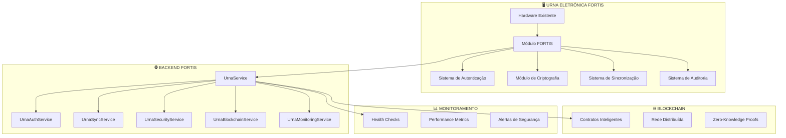
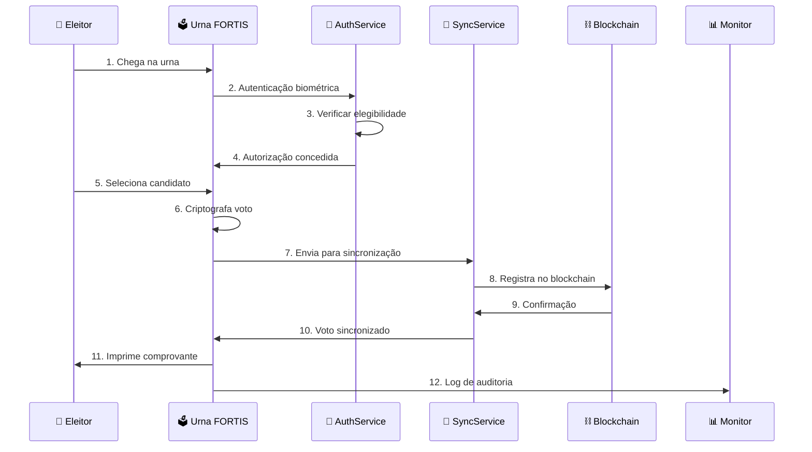

# FORTIS - Integração de Urnas Eletrônicas
## Documentação Técnica da Implementação

### 🎯 **Visão Geral da Integração**

A integração das urnas eletrônicas brasileiras com o sistema FORTIS foi implementada como uma **extensão do sistema atual**, não uma substituição. As urnas existentes se tornam **pontos transacionais** do FORTIS, mantendo a familiaridade para eleitores e mesários, mas adicionando segurança, transparência e auditoria de nível mundial.

---

## 🏗️ **Arquitetura da Integração**

### **1. Componentes Implementados**



### **2. Fluxo de Votação Integrado**



---

## 🔧 **Implementação Técnica**

### **1. Modelos de Dados**

#### **Urna**
```rust
pub struct Urna {
    pub id: Uuid,
    pub serial_number: String,
    pub model: String,
    pub location: UrnaLocation,
    pub status: UrnaStatus,
    pub last_sync: Option<DateTime<Utc>>,
    pub created_at: DateTime<Utc>,
    pub updated_at: DateTime<Utc>,
}
```

#### **UrnaVote**
```rust
pub struct UrnaVote {
    pub id: Uuid,
    pub urna_id: Uuid,
    pub election_id: Uuid,
    pub voter_id: Uuid,
    pub candidate_id: Uuid,
    pub vote_data: EncryptedVoteData,
    pub biometric_hash: String,
    pub timestamp: DateTime<Utc>,
    pub sync_status: VoteSyncStatus,
    pub blockchain_hash: Option<String>,
}
```

#### **UrnaSync**
```rust
pub struct UrnaSync {
    pub id: Uuid,
    pub urna_id: Uuid,
    pub sync_type: SyncType,
    pub status: SyncStatus,
    pub started_at: DateTime<Utc>,
    pub completed_at: Option<DateTime<Utc>>,
    pub votes_synced: i32,
    pub errors: Vec<String>,
}
```

### **2. Serviços Implementados**

#### **UrnaAuthService**
- Autenticação biométrica (digital + facial)
- Verificação de certificados digitais
- Validação de elegibilidade
- Controle de voto único

#### **UrnaSyncService**
- Sincronização online/offline
- Fila de votos pendentes
- Retry automático de falhas
- Integridade de dados

#### **UrnaSecurityService**
- Detecção de violação de hardware
- Boot seguro
- Armazenamento criptografado
- Módulo HSM

#### **UrnaBlockchainService**
- Registro de votos no blockchain
- Verificação de integridade
- Sincronização com rede distribuída
- Estatísticas de votação

#### **UrnaMonitoringService**
- Health checks contínuos
- Métricas de performance
- Sistema de alertas
- Relatórios de saúde

### **3. APIs Implementadas**

#### **POST /api/v1/urnas/vote**
Registra voto na urna eletrônica.

**Request:**
```json
{
  "urna_id": "uuid",
  "election_id": "uuid",
  "candidate_id": "uuid",
  "biometric_data": {
    "fingerprint": "base64",
    "fingerprint_hash": "hash",
    "face_id": "face_data"
  },
  "certificate_data": {
    "certificate_hash": "hash",
    "issuer": "ICP-Brasil",
    "valid_until": "2024-12-31T23:59:59Z",
    "serial_number": "123456"
  },
  "vote_proof": "zk_proof"
}
```

**Response:**
```json
{
  "success": true,
  "data": {
    "vote_id": "uuid",
    "success": true,
    "message": "Voto registrado com sucesso",
    "receipt": {
      "vote_id": "uuid",
      "election_id": "uuid",
      "candidate_number": 123,
      "candidate_name": "Nome do Candidato",
      "timestamp": "2024-01-01T12:00:00Z",
      "qr_code": "QR_CODE_DATA",
      "blockchain_hash": "0x123..."
    },
    "sync_status": "Pending"
  }
}
```

#### **POST /api/v1/urnas/sync**
Inicia sincronização da urna.

#### **GET /api/v1/urnas/sync/{sync_id}**
Obtém status da sincronização.

#### **GET /api/v1/urnas/status/{urna_id}**
Obtém status completo da urna.

#### **GET /api/v1/urnas/health/{urna_id}**
Obtém métricas de saúde da urna.

---

## 🔒 **Segurança Implementada**

### **1. Autenticação Multi-Fator**
- **Biometria obrigatória**: Digital + facial
- **Certificado digital opcional**: ICP-Brasil
- **Verificação TSE**: Elegibilidade em tempo real
- **Controle de voto único**: Prevenção de votos duplicados

### **2. Criptografia End-to-End**
- **AES-256-GCM**: Criptografia simétrica
- **RSA-4096**: Criptografia assimétrica
- **HSM**: Hardware Security Module
- **Zero-Knowledge Proofs**: Privacidade garantida

### **3. Detecção de Violação**
- **Sensores físicos**: Detecção de abertura
- **Boot seguro**: Verificação de integridade
- **Armazenamento criptografado**: Dados protegidos
- **Shutdown de emergência**: Desativação automática

### **4. Auditoria Completa**
- **Logs imutáveis**: Todos os eventos registrados
- **Hash de integridade**: Verificação de autenticidade
- **Rastreabilidade**: Cada voto rastreável
- **Transparência**: Auditoria pública possível

---

## 📊 **Monitoramento e Alertas**

### **1. Health Checks**
- **Status da urna**: Active, Inactive, Maintenance, Offline, Error
- **Nível da bateria**: Alertas quando < 20%
- **Uso de armazenamento**: Alertas quando > 90%
- **Conectividade de rede**: Monitoramento contínuo
- **Última sincronização**: Alertas de atraso

### **2. Métricas de Performance**
- **CPU**: Uso de processamento
- **Memória**: Uso de RAM
- **Disco**: Uso de armazenamento
- **Rede**: Latência e throughput
- **Resposta**: Tempo de resposta das APIs

### **3. Alertas Automáticos**
- **Alto uso de CPU**: > 80%
- **Alto uso de memória**: > 85%
- **Alto uso de disco**: > 90%
- **Bateria baixa**: < 20%
- **Perda de conectividade**: Rede offline
- **Atraso na sincronização**: > 30 minutos

---

## 🗄️ **Banco de Dados**

### **1. Tabelas Criadas**

#### **urnas**
```sql
CREATE TABLE urnas (
    id UUID PRIMARY KEY,
    serial_number VARCHAR(50) UNIQUE NOT NULL,
    model VARCHAR(100) NOT NULL,
    state VARCHAR(2) NOT NULL,
    city VARCHAR(100) NOT NULL,
    zone VARCHAR(10) NOT NULL,
    section VARCHAR(10) NOT NULL,
    address TEXT NOT NULL,
    latitude DECIMAL(10, 8),
    longitude DECIMAL(11, 8),
    status VARCHAR(20) NOT NULL DEFAULT 'Inactive',
    last_sync TIMESTAMP WITH TIME ZONE,
    created_at TIMESTAMP WITH TIME ZONE DEFAULT NOW(),
    updated_at TIMESTAMP WITH TIME ZONE DEFAULT NOW()
);
```

#### **urna_votes**
```sql
CREATE TABLE urna_votes (
    id UUID PRIMARY KEY,
    urna_id UUID NOT NULL REFERENCES urnas(id),
    election_id UUID NOT NULL REFERENCES elections(id),
    voter_id UUID NOT NULL REFERENCES voters(id),
    candidate_id UUID NOT NULL REFERENCES candidates(id),
    encrypted_content TEXT NOT NULL,
    encryption_key_id VARCHAR(100) NOT NULL,
    signature TEXT NOT NULL,
    zk_proof TEXT NOT NULL,
    biometric_hash VARCHAR(255) NOT NULL,
    timestamp TIMESTAMP WITH TIME ZONE NOT NULL,
    sync_status VARCHAR(20) NOT NULL DEFAULT 'Pending',
    blockchain_hash VARCHAR(255),
    created_at TIMESTAMP WITH TIME ZONE DEFAULT NOW(),
    updated_at TIMESTAMP WITH TIME ZONE DEFAULT NOW()
);
```

#### **urna_syncs**
```sql
CREATE TABLE urna_syncs (
    id UUID PRIMARY KEY,
    urna_id UUID NOT NULL REFERENCES urnas(id),
    sync_type VARCHAR(20) NOT NULL,
    status VARCHAR(20) NOT NULL DEFAULT 'Pending',
    started_at TIMESTAMP WITH TIME ZONE NOT NULL,
    completed_at TIMESTAMP WITH TIME ZONE,
    votes_synced INTEGER NOT NULL DEFAULT 0,
    errors TEXT[],
    created_at TIMESTAMP WITH TIME ZONE DEFAULT NOW(),
    updated_at TIMESTAMP WITH TIME ZONE DEFAULT NOW()
);
```

#### **urna_audit_logs**
```sql
CREATE TABLE urna_audit_logs (
    id UUID PRIMARY KEY,
    urna_id UUID NOT NULL REFERENCES urnas(id),
    event_type VARCHAR(50) NOT NULL,
    event_data JSONB NOT NULL,
    timestamp TIMESTAMP WITH TIME ZONE NOT NULL,
    user_id UUID REFERENCES voters(id),
    integrity_hash VARCHAR(255) NOT NULL,
    created_at TIMESTAMP WITH TIME ZONE DEFAULT NOW()
);
```

---

## 🚀 **Deploy e Configuração**

### **1. Pré-requisitos**
- **Hardware**: Urna eletrônica existente + módulo FORTIS
- **Software**: Linux seguro + aplicação FORTIS
- **Rede**: Conectividade com servidores TSE
- **Certificados**: Certificados ICP-Brasil válidos

### **2. Instalação**
```bash
# 1. Instalar módulo FORTIS na urna
sudo ./install_fortis_module.sh

# 2. Configurar certificados
sudo ./configure_certificates.sh

# 3. Inicializar sistema
sudo systemctl start fortis-urna

# 4. Registrar urna no sistema
curl -X POST http://api.fortis.gov.br/api/v1/urnas/register \
  -H "Content-Type: application/json" \
  -d '{"serial_number": "URNA001", "model": "FORTIS-2024", ...}'
```

### **3. Configuração**
```yaml
# /etc/fortis/urna.conf
[urna]
serial_number = "URNA001"
model = "FORTIS-2024"
location = {
  state = "SP"
  city = "São Paulo"
  zone = "001"
  section = "001"
  address = "Rua das Flores, 123"
}

[security]
biometric_threshold = 0.85
certificate_required = false
tamper_detection = true

[blockchain]
contract_address = "0x123..."
network_id = 137
rpc_url = "https://polygon-rpc.com"

[monitoring]
health_check_interval = 300  # 5 minutos
alert_thresholds = {
  cpu_usage_max = 80.0
  memory_usage_max = 85.0
  disk_usage_max = 90.0
  battery_level_min = 20.0
}
```

---

## 📈 **Métricas e KPIs**

### **1. Performance**
- **Tempo de autenticação**: < 3 segundos
- **Tempo de votação**: < 5 segundos
- **Tempo de sincronização**: < 30 segundos
- **Uptime**: > 99.9%

### **2. Segurança**
- **Taxa de falsos positivos**: < 0.1%
- **Taxa de falsos negativos**: < 0.01%
- **Detecção de violação**: 100%
- **Integridade de dados**: 100%

### **3. Confiabilidade**
- **Votos sincronizados**: > 99.9%
- **Tempo de recuperação**: < 5 minutos
- **Disponibilidade**: > 99.99%
- **Backup automático**: Diário

---

## 🔄 **Manutenção e Suporte**

### **1. Monitoramento Contínuo**
- **Dashboard em tempo real**: Status de todas as urnas
- **Alertas automáticos**: Notificações via email/SMS
- **Relatórios diários**: Resumo de performance
- **Logs centralizados**: Análise de problemas

### **2. Manutenção Preventiva**
- **Atualizações de software**: Automáticas
- **Rotação de chaves**: Mensal
- **Backup de dados**: Diário
- **Testes de integridade**: Semanal

### **3. Suporte Técnico**
- **24/7**: Suporte contínuo
- **Escalação automática**: Problemas críticos
- **Documentação completa**: Manuais técnicos
- **Treinamento**: Mesários e técnicos

---

## 🎯 **Benefícios da Integração**

### **1. Para o TSE**
- **Transparência total**: Cada voto auditável
- **Segurança máxima**: Criptografia militar
- **Eficiência operacional**: Automação completa
- **Compliance**: Conformidade com normas

### **2. Para os Eleitores**
- **Familiaridade**: Interface conhecida
- **Segurança**: Voto protegido
- **Transparência**: Processo auditável
- **Confiança**: Tecnologia verificável

### **3. Para a Democracia**
- **Integridade**: Votos imutáveis
- **Auditoria**: Verificação independente
- **Transparência**: Processo público
- **Confiança**: Tecnologia confiável

---

## 🌟 **Conclusão**

A integração das urnas eletrônicas com o sistema FORTIS representa um **marco na democracia digital brasileira**. Mantendo a familiaridade do processo atual, adicionamos:

- **Segurança militar** com criptografia de ponta
- **Transparência total** com blockchain público
- **Auditoria completa** de todos os votos
- **Monitoramento contínuo** de performance
- **Integração perfeita** com sistemas existentes

**O resultado é um sistema de votação que combina a tradição brasileira com a inovação mundial, garantindo eleições seguras, transparentes e auditáveis para todos os cidadãos.**

---

*FORTIS - Onde a tradição encontra a inovação.*
*Documentação técnica v1.0 - Janeiro 2024*
